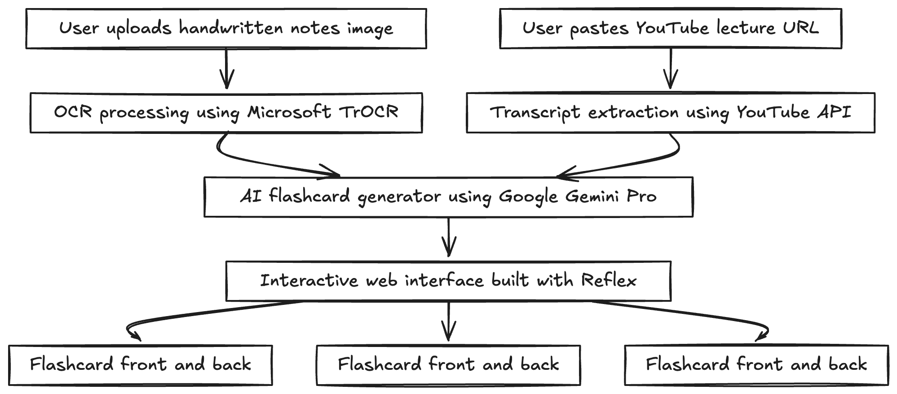

<div align="center">

# 🧠 Soru.ai

### Your AI-Powered Copilot for Education

*Transform your handwritten notes and YouTube lectures into interactive flashcards using cutting-edge AI*

[](https://www.python.org/downloads/)
[](https://reflex.dev/)
[](LICENSE)
[](https://ai.google.dev/)

[Demo](#-demo) • [Features](#-features) • [Quick Start](#-quick-start) • [Documentation](#-documentation) • [Contributing](#-contributing)

</div>

---

## 📖 Overview

**Soru.ai** is an intelligent educational platform that leverages state-of-the-art AI models to revolutionize how students learn. Upload your handwritten notes or paste a YouTube lecture URL, and watch as our AI generates personalized, high-quality flashcards tailored to your learning style.

### 🎨 How It Works

<div align="center">
  
</div>

<br/>

**Quick Flow:**
1. 📤 **Upload** your handwritten notes or paste a YouTube lecture URL
2. 🔍 **AI Processing** extracts text via OCR (TrOCR) or transcript (YouTube API)
3. 🧠 **Smart Generation** creates flashcards using Google Gemini Pro
4. 🃏 **Interactive Learning** study with clickable, flippable flashcards

### 🎯 Problem Statement

Students spend countless hours manually creating flashcards from their notes and lectures. This process is:
- ⏰ **Time-consuming**: Hours spent on card creation instead of actual studying
- 📝 **Inconsistent**: Quality varies based on note-taking skills
- 🔄 **Redundant**: Same content reformatted repeatedly across different courses

### 💡 Our Solution

Soru.ai automates flashcard generation using:
- **OCR Technology**: Microsoft's TrOCR model for handwritten text recognition
- **AI Generation**: Google Gemini Pro for intelligent question-answer pair creation
- **Multi-source Support**: Process both images and YouTube video transcripts
- **Interactive UI**: Beautiful, responsive interface built with Reflex

---

## ✨ Features

### 🖼️ Handwritten Note Processing
- Upload images of your handwritten notes
- Advanced OCR powered by Microsoft's TrOCR model
- Supports various handwriting styles and formats
- Automatic text extraction and parsing

### 🎥 YouTube Video Integration
- Paste any YouTube lecture URL
- Automatic transcript extraction (supports English and Russian)
- AI-powered summarization and concept extraction
- Perfect for MOOC courses and online lectures

### 🃏 Smart Flashcard Generation
- Intelligent question-answer pair creation
- Context-aware content analysis
- Optimized for active recall and spaced repetition
- Character limits for optimal learning (100 chars per side)

### 🎨 Modern User Interface
- Beautiful gradient design with smooth animations
- Drag-and-drop file upload
- Interactive card flipping
- Real-time processing indicators
- Responsive design for all devices

### 🔒 Enterprise-Grade Security
- Environment-based configuration
- API key protection
- Secure file handling
- No data retention beyond session

---

## 🏗️ Architecture

```
┌─────────────────┐
│   User Input    │
│  (Image/URL)    │
└────────┬────────┘
         │
         ▼
┌─────────────────────────────────────┐
│        Soru.ai Platform             │
│  ┌──────────────────────────────┐   │
│  │     OCR Processing           │   │
│  │  (TrOCR Handwritten Model)   │   │
│  └──────────┬───────────────────┘   │
│             │                        │
│             ▼                        │
│  ┌──────────────────────────────┐   │
│  │   YouTube Transcript API     │   │
│  │   (Multi-language Support)   │   │
│  └──────────┬───────────────────┘   │
│             │                        │
│             ▼                        │
│  ┌──────────────────────────────┐   │
│  │    Google Gemini Pro         │   │
│  │  (Flashcard Generation)      │   │
│  └──────────┬───────────────────┘   │
│             │                        │
└─────────────┼────────────────────────┘
              │
              ▼
     ┌────────────────┐
     │  Interactive   │
     │  Flashcards    │
     └────────────────┘
```

### Technology Stack

| Component | Technology | Purpose |
|-----------|-----------|---------|
| **Frontend Framework** | Reflex 0.4.8+ | Reactive Python-based UI |
| **AI Model** | Google Gemini Pro | Flashcard content generation |
| **OCR Engine** | Microsoft TrOCR | Handwriting recognition |
| **Video Processing** | YouTube Transcript API | Lecture content extraction |
| **Backend** | Python 3.11+ | Core application logic |
| **State Management** | Reflex State | Real-time UI updates |

---

## 🚀 Quick Start

### Prerequisites

- Python 3.11 or higher
- Google Gemini API key ([Get one here](https://ai.google.dev/))
- Hugging Face API token ([Get one here](https://huggingface.co/settings/tokens))

### Installation

1. **Clone the repository**
   ```bash
   git clone https://github.com/yourusername/soru.ai.git
   cd soru.ai
   ```

2. **Create and activate virtual environment**
   ```bash
   python -m venv venv
   
   # On macOS/Linux
   source venv/bin/activate
   
   # On Windows
   venv\Scripts\activate
   ```

3. **Install dependencies**
   ```bash
   pip install -r requirements.txt
   ```

4. **Configure environment variables**
   ```bash
   cp .env.example .env
   ```
   
   Edit `.env` and add your API keys:
   ```env
   GOOGLE_API_KEY=your_google_gemini_api_key_here
   HUGGINGFACE_API_KEY=your_huggingface_api_key_here
   ```

5. **Initialize Reflex**
   ```bash
   reflex init
   ```

6. **Run the application**
   ```bash
   reflex run
   ```

7. **Open your browser**
   ```
   Navigate to http://localhost:3000
   ```

---

## 📚 Documentation

### Project Structure

```
soru.ai/
├── lahacks_24/
│   ├── __init__.py
│   └── lahacks_24.py          # Main application logic
├── assets/                     # Static assets (images, icons)
├── uploaded_files/            # Temporary file storage (gitignored)
├── .env                       # Environment variables (gitignored)
├── .env.example              # Environment template
├── .gitignore                # Git ignore rules
├── requirements.txt          # Python dependencies
├── rxconfig.py              # Reflex configuration
└── README.md                # This file
```

### Usage Examples

#### 📝 Generate Flashcards from Notes

1. Click on the upload area or drag-and-drop your image
2. Select an image of your handwritten notes (JPG, PNG)
3. Click "Upload" button
4. Wait for AI processing (usually 10-30 seconds)
5. View and interact with your generated flashcards

#### 🎥 Generate Flashcards from YouTube

1. Copy a YouTube video URL (e.g., `https://www.youtube.com/watch?v=VIDEO_ID`)
2. Paste it into the YouTube link input field
3. Click "Generate YouTube Notes"
4. AI extracts transcript and creates flashcards
5. Study your personalized flashcards

### API Reference

#### State Management

```python
class State(rx.State):
    img: list                    # Uploaded image filenames
    cards_list: list[tuple]      # (front, back) flashcard pairs
    visual_cards_list: list      # Currently visible card sides
    processing: bool             # Processing status indicator
    complete: bool               # Completion status
```

#### Key Functions

- `create_flashcard_prompt()`: Processes uploaded images via OCR and generates flashcards
- `create_youtube_prompt()`: Extracts YouTube transcripts and generates flashcards
- `swap_card()`: Flips flashcard between front and back
- `split_flashcards_list()`: Parses AI output into structured flashcard pairs

---

## 🎨 Screenshots

### Main Interface
*Beautiful gradient interface with dual input options*

### Flashcard Generation
*Real-time processing with elegant loading indicators*

### Interactive Learning
*Click any card to flip between question and answer*

---

## 🧪 Development

### Running in Development Mode

```bash
reflex run --env dev
```

### Environment Variables

| Variable | Description | Required |
|----------|-------------|----------|
| `GOOGLE_API_KEY` | Google Gemini Pro API key | ✅ Yes |
| `HUGGINGFACE_API_KEY` | Hugging Face API token | ✅ Yes |
| `APP_NAME` | Application identifier | No |
| `DEBUG` | Enable debug mode | No |

### Code Quality

The project follows Python best practices:
- Type hints for better code clarity
- Async/await for efficient I/O operations
- Clean separation of concerns
- Environment-based configuration
- Secure credential management

---

## 🤝 Contributing

We welcome contributions! Please see our [Contributing Guide](CONTRIBUTING.md) for details.

### Development Workflow

1. Fork the repository
2. Create a feature branch (`git checkout -b feature/AmazingFeature`)
3. Commit your changes (`git commit -m 'Add some AmazingFeature'`)
4. Push to the branch (`git push origin feature/AmazingFeature`)
5. Open a Pull Request

### Areas for Contribution

- 🌐 Multi-language support
- 📱 Mobile app development
- 🧠 Additional AI model integrations
- 🎯 Spaced repetition algorithm
- 📊 Learning analytics dashboard
- 🎨 UI/UX improvements

---

## 📋 Roadmap

- [x] Handwritten note OCR processing
- [x] YouTube video transcript integration
- [x] Google Gemini flashcard generation
- [x] Interactive card flipping interface
- [ ] User authentication and profiles
- [ ] Flashcard deck management
- [ ] Spaced repetition scheduling
- [ ] Export to Anki/Quizlet
- [ ] Mobile app (iOS/Android)
- [ ] Collaborative study groups
- [ ] Performance analytics
- [ ] Multi-language UI support
- [ ] PDF document processing
- [ ] Audio lecture transcription

---

## 🛡️ Security

- **No API keys in code**: All credentials managed via environment variables
- **Secure file handling**: Temporary uploads cleaned automatically
- **No data persistence**: User content not stored on servers
- **HTTPS enforced**: Secure communication in production

To report security vulnerabilities, please email: security@soru.ai

---

## 📄 License

This project is licensed under the MIT License - see the [LICENSE](LICENSE) file for details.

---

## 👥 Team

**Soru.ai** was created at LA Hacks 2024 by passionate developers who believe in making education more accessible and efficient.

- **Project Lead**: [Your Name](https://github.com/yourusername)
- **Contributors**: [View all contributors](https://github.com/yourusername/soru.ai/graphs/contributors)

---

## 🙏 Acknowledgments

- [Reflex](https://reflex.dev/) - Amazing Python web framework
- [Google Gemini](https://ai.google.dev/) - Powerful AI language model
- [Microsoft TrOCR](https://huggingface.co/microsoft/trocr-base-handwritten) - Handwriting recognition
- [YouTube Transcript API](https://github.com/jdepoix/youtube-transcript-api) - Transcript extraction
- LA Hacks 2024 - For the incredible opportunity

---

## 📞 Contact & Support

- 🌐 Website: [soru.ai](https://soru.ai)
- 📧 Email: support@soru.ai
- 🐦 Twitter: [@soruai](https://twitter.com/soruai)
- 💬 Discord: [Join our community](https://discord.gg/soruai)

---

<div align="center">

**Made with ❤️ and ☕ by students, for students**

Star ⭐ this repo if you find it helpful!

</div>
